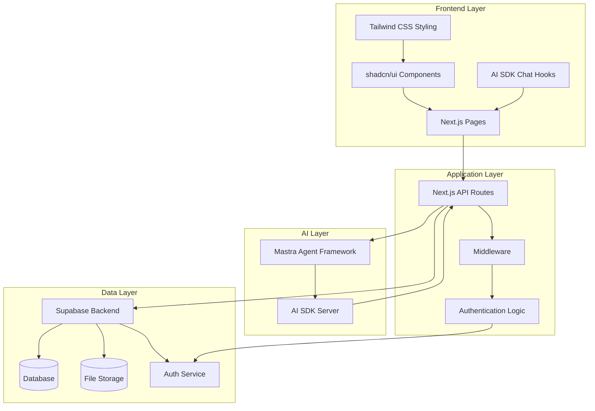
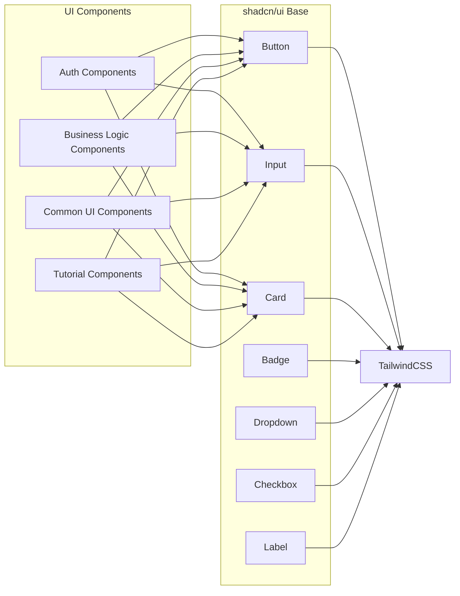
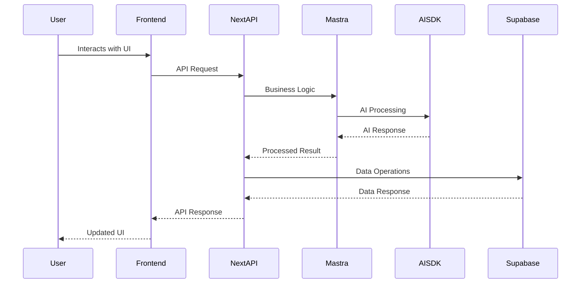
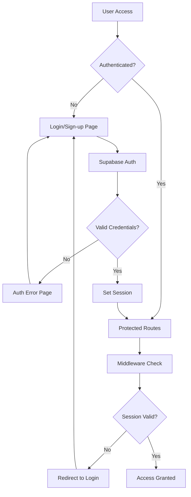
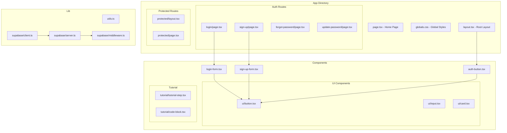

# TimeScript App Architecture

This document describes the target architecture of the timescript application. It is a living document that evolves as we gain experience and make architectural decisions.

## Overview

TimeScript is a modern web application built with Next.js that combines AI-powered functionality with a clean, responsive user interface. The architecture follows a clear separation of concerns with distinct layers for frontend, backend, and AI processing.

## Technology Stack

For detailed information about each framework and library, see [frameworks.md](../frameworks/frameworks.md).

### Frontend

- **Next.js** - React framework for production
- **shadcn/ui** - Component library for UI components
- **Tailwind CSS** - Utility-first CSS framework
- **AI SDK** - Client-side AI interactions and chat hooks

### Backend

- **Supabase** - Backend-as-a-Service for data storage and authentication
- **Next.js API Routes** - Server-side logic

### AI/Agent Framework

- **Mastra** - Agent framework carrying core business logic
- **AI SDK** - Server-client AI communication

## Architecture Diagram

## Component Architecture

## Data Flow

## Authentication Flow

## File Structure Mapping

## Key Architectural Decisions

### 1. Framework Choice

- **Next.js**: Chosen for its full-stack capabilities, excellent developer experience, and built-in optimizations
- **React**: Component-based architecture for maintainable and reusable UI

### 2. Styling Strategy

- **Tailwind CSS**: Utility-first approach for rapid development and consistent design
- **shadcn/ui**: Pre-built, accessible components that integrate seamlessly with Tailwind

### 3. Backend Strategy

- **Supabase**: BaaS solution providing database, authentication, and real-time features
- **Next.js API Routes**: Server-side logic and API endpoints

### 4. AI Integration

- **Mastra**: Agent framework for complex business logic and AI workflows
- **AI SDK**: Streamlined AI interactions between client and server

### 5. Authentication

- **Supabase Auth**: Integrated authentication with session management
- **Middleware**: Route protection and session validation

## Future Considerations

As this is a living document, future architectural decisions may include:

1. **Scalability**: Consider microservices architecture if the application grows
2. **State Management**: Evaluate need for global state management (Redux, Zustand)
3. **Real-time Features**: Leverage Supabase real-time capabilities
4. **Performance**: Implement caching strategies and optimize bundle sizes
5. **Testing**: Add comprehensive testing strategy
6. **Monitoring**: Implement logging and error tracking
7. **Deployment**: Consider containerization and CI/CD pipelines

## Related Documentation

- [Frameworks and Libraries](../frameworks/frameworks.md)
- [Mastra Agent Framework](../frameworks/mastra.md)
- [Supabase Integration](../frameworks/supabase_js.md)
- [shadcn/ui Components](../frameworks/shadcn.md)
- [Tailwind CSS](../frameworks/tailwind.md)
